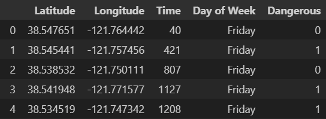
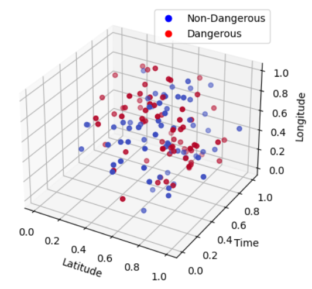
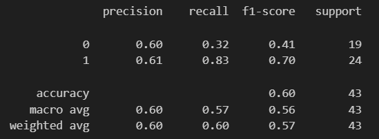
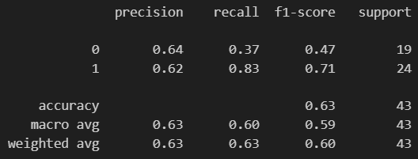

# Via

# Machine Learning/Training Portion

## Introduction

In recent times, concerns about personal safety have become prevalent among individuals on campus. While it is reassuring to know that the crime rate in Davis is significantly lower than the national average, with violent crime incidents per 1000 residents being nearly four times lower than the state average in California, there is still a lingering question: Is it truly safe to walk alone, particularly given recent events?

This project aims to answer this question by predicting the likelihood of a dangerous crime based on the geographic location (latitude and longitude) and time. Such a model could help students and residents alike, warning them of when it may be risky to walk alone.

NOTE: In our data, we described dangerous crimes as anything that may threaten the safety of an individual. These include crimes like: theft, collisions, possession of a weapon, etc.


# Figures

Data Source: https://police.ucdavis.edu/dashboard/crime-logs

Data Table:




# Methods

## Data Preprocessing

1. Our data was not in the format we needed it to be in, as location is given by address. We manually converted each address to latitude and logitude coordinates, while also changing the time to be in minutes. Type of crime was converted to a 1 if dangerous, and 0 if not.
2. Drop any unnecessary features. For example, the Arestee and their date of birth is irrelevant to our model, so they were dropped.
3. Scale the data with MinMaxScaler().
    ```
    # Create an instance of MinMaxScaler
    scaler = MinMaxScaler()
    dow_col = df_raw['Day of Week']

    # Drop day of week, as it does not need to be scaled
    df_nodow = df_raw.drop(['Day of Week', 'Dangerous'], axis='columns')

    # Fit the scaler to your data to compute the minimum and maximum values
    scaler.fit(df_nodow)

    # Perform the Min-Max normalization on your data
    normalized_data = scaler.transform(df_nodow)
    df = pd.DataFrame(normalized_data, columns = ['Latitude','Longitude','Time'])

    ```
4. Partition into training and test data. We decided to use a train/test split of 80/20.
    ```
    # We originally also used the day of week (i.e. Monday, Tuesday, etc.)
    # but found it to lower the accuracy. With more data in the future, we could possibly implement it in.
    df_ndow = df.drop("Day of Week", axis='columns')
    X_train, X_test, y_train, y_test = train_test_split(df_ndow.drop(['Dangerous'], axis=1), df_ndow.Dangerous, test_size=0.2, random_state=21)

    ```


## Data Exploration

### Data Scatter Plot:
- Our scatter plot after scaling data:




## Training Models

### Model 1

For our first model, we decided to use a logistic regression model.
```
logreg = LogisticRegression()
logreg.fit(X_train, y_train)
```

### Model 2

For our second model, we decided on a KNN model, with k=7.
```
knn = KNeighborsClassifier(n_neighbors=7)
knn.fit(X_train, y_train)
```

## Results

### Model 1

Classifcation Report:



### Model 2

Classification Report:




## Conclusion

- Whether or not a crime that happens is dangerous to an individual can be reliably predicted
- Lack of data was our greatest limitation, as we only had data from a little over two full months. Training the model on data spanning multiple years would likely significantly increase performance.
- Further research would consist of fitting and evaluating different classification models, as well as obtaining a more robust data set. In addition, we could expand the model to classify more types of crime, likelihood of a crime happening, and even recommended paths to take from an origin to a destination.


